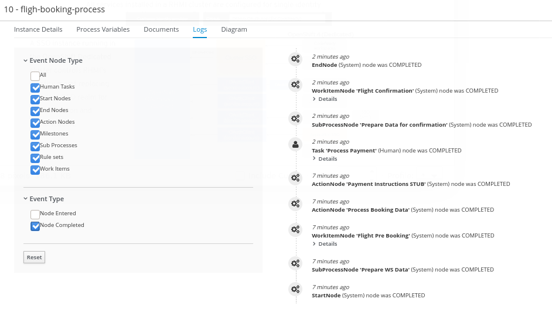

= ER-Demo Datawarehouse

:numbered:

== Status

=== Completed

. Kafka consumers in this _datawarehouse_ project collect and parse various incident, mission, and responder related messages.
. Data from those messages is persisted into a PostgreSQL based de-normalized datawarehouse
. ER-Demo _process-service_ is modified to send _processInstanceId_ in the  _CreateMissionCommand_ message.
. Several rudimentary reports have been created in the _Page Designer (aka: Dashbuilder)_ component of Business Central v7.6.
.. *Site Commander KPIs*
... Target Daily Rescued _meter_
... Total Rescued _metric_
... Total Responders _metric_

.. *Responder KPIs*
... Top Responders _bar_
... Fastest Pickup Speeds _bar_
... Slowest Pickup Speeds _bar_
... Fastest Drop Off Speeds _bar_
... Slowest Drop Off Speeds _bar_

=== To-Do

. _Slowest Incidents_ bar report
.. displays top 10 slowest end-to-end incidents
.. click one of the incidents in bar report to drill-down into the _process log_ for the corresponding process instance:
+

. Dashboard look-n-feel (William)
+
https://reporting.opentlc.com/dashbuilder/index.jsp

. Dashboards not automatically refreshing (William)
. Automated import / export of dashboards (William)
. Automate import / export of drivers & datasources (William)
+
Instead of utilzing BC Admin functionality, should these just be loaded as JBoss EAP modules ?

. Enabling Process & Task Reports when KIE-Server does not exist (William)
. Creation of new "Page" in RHPAM-Monitoring (William)
.. Activity not found
+
The location you try to open is inaccessible. Please double check it is an existing location and you have permissions to see it: Settings -> Roles -> Permissions.
. Handle Mission Failures
. Persist MissionCompleted events in batch
. Occasional exception when retrieving responder data from _datawarehouse service_:
+
https://gist.github.com/jbride/836f04593d0ac26630e8fd52c1f11c55

== Development

. Clone this project:
+
-----
git clone https://github.com/Emergency-Response-Demo/datawarehouse $ER_DEMO_HOME/datawarehouse

-----

. Build:
+
-----
cd $ER_DEMO_HOME/datawarehouse
mvn clean install -DskipTests
-----

== Deployment to OCP

The following assumes that you've already built and deployed all the other components of ER-Demo to your OCP4 environment.

=== Datawarehouse PostgreSQL

-----
cd $ER_DEMO_HOME/install/ansible

ansible-playbook -i inventories/inventory playbooks/datawarehouse.yml \
      -e namespace_sso=user-sso \
      -e project_admin=$ERDEMO_USER \
      -e project_name=$ERDEMO_USER-er-demo \
      -e install_datawarehouse=True
-----

=== Datawarehouse Service

. Build and push to Quay
+
-----
cd $ER_DEMO_HOME/datawarehouse

podman build -f src/main/docker/Dockerfile.jvm -t quay.io/jbride/datawarehouse:0.0.1 .

podman push quay.io/jbride/datawarehouse:0.0.1
-----

. Refresh IS
+
-----
oc import-image datawarehouse --all=true --from=quay.io/jbride/datawarehouse --confirm
-----

. OCP resources
+
-----
cd $ER_DEMO_HOME/datawarehouse
vi src/main/resources/application.properties                                            #   Review runtime properties

oc create configmap datawarehouse --from-file=src/main/resources/application.properties
oc create serviceaccount datawarehouse 
oc policy add-role-to-user view system:serviceaccount:$(oc project --short):datawarehouse
oc apply -f src/main/ocp/service/datawarehouse-imagestream.yml
oc apply -f src/main/ocp/service/datawarehouse-service.yml
-----

== Local Deployment and Test

. In terminal 1; start-up zookeeper, kafka and postgresql
+
-----
podman-compose -f etc/docker-compose.yaml up
-----

. In terminal 2
+
-----
podman pod ps                                                                                   # check on status of previously started pod

psql -h 127.0.01 -U naps -d datawarehouse -a -f ../sql-scripts/dw_database_ddl.sql              # initialize postgresql

less config/application.properties                                                              # review / edit properties that over-ride props in src/main/resources/application.properties

mvn clean install -DskipTests \
    && mvn quarkus:build \
    && java -jar target/datawarehouse-0.0.11-runner.jar                                         : build and start app

mvn clean install -DskipTests \
    && mvn quarkus:build \
    && java -agentlib:jdwp=transport=dt_socket,server=y,suspend=y,address=8484 \
            -jar target/datawarehouse-0.0.11-runner.jar                                         : build and start app with debugger enabled
                                                                                                : https://developers.redhat.com/blog/2017/12/19/debug-java-openshift-vscode-cdk/
-----

. In terminal 3:
+
-----
/opt/kafka_2.12-2.4.0/bin/kafka-topics.sh --list --bootstrap-server localhost:9092              # List existing topics

/opt/kafka_2.12-2.4.0/bin/kafka-console-producer.sh \
    --broker-list localhost:9092 \
    --topic topic-mission-command < src/test/resources/CreateMissionCommand2.json               # Send a CreateMissionCommand event to a kafka topic

/opt/kafka_2.12-2.4.0/bin/kafka-console-producer.sh \
    --broker-list localhost:9092 \
    --topic topic-mission-event < src/test/resources/MissionStartedEvent2.json                  # Send an MissionStarted event to a kafka topic

/opt/kafka_2.12-2.4.0/bin/kafka-console-producer.sh \
    --broker-list localhost:9092 \
    --topic topic-responder-location-update \
    < src/test/resources/topicResponderLocationUpdate_PICKEDUP2.json                            # Send a ResponderLocationUpdate event to kafka topic

/opt/kafka_2.12-2.4.0/bin/kafka-console-producer.sh \
    --broker-list localhost:9092 \
    --topic topic-incident-event \
    < src/test/resources/TopicIncidentEventPickedup2.json                                       # Send an IncidentUpdateEvent to kafka topic

/opt/kafka_2.12-2.4.0/bin/kafka-console-producer.sh \
    --broker-list localhost:9092 \
    --topic topic-mission-event < src/test/resources/MissionCompletedEvent2.json                # Send an MissionCompleted event to a kafka topic
-----

== Creating Dashboards

. Create _psql_driver_ driver
+
-----
class name: org.postgresql.Driver
groupId:    org.postgresql
artifactId: postgresql
version:    42.2.5
-----

.  Create _dw_postgresql_ datasource
+
-----
connectionUrl:  jdbc:postgresql://dw-postgresql.user3-er-demo.svc:5432/datawarehouse
user:           naps
passwd:         naps
-----

. Create _erdemo_pam_datasource_ datasource
+
-----
connectionUrl:  jdbc:postgresql://user3-process-service-postgresql.user3-er-demo.svc:5432/user3-rhpam
user:           user3-rhpam
passwd:         user3-rhpam
-----

. Database queries
+
-----
# psql user1-rhpam
# \copy (select EXTRACT(EPOCH FROM log_date)*1000, nodeinstanceid, nodename, type from nodeinstancelog where processinstanceid=2 order by log_date ASC) TO '/tmp/incident_with_existing_responder.csv' CSV HEADER
-----

From jboss-eap-modules:7.2.x-openjdk11 os-eap-datasource/1.0/added/launch/datasource-common.sh
-----
        - name: JAVA_OPTS_APPEND
          value: -Dorg.uberfire.nio.git.ssh.algorithm=RSA -Dorg.kie.server.persistence.ds=java:jboss/datasources/erdemopam_postgresql
        - name: DB_SERVICE_PREFIX_MAPPING
          value: erdemopam-postgresql=ERPAM
        - name: erdemopam-postgresql_SERVICE_HOST
          value: user3-process-service-postgresql.user3-er-demo.svc
        - name: erdemopam-postgresql_SERVICE_PORT
          value: '5432'
        - name: ERPAM_NONXA
          value: "true"
        - name: ERPAM_URL
          value: jdbc:postgresql://user3-process-service-postgresql.user3-er-demo.svc:5432/user3-rhpam
        - name: ERPAM_VALIDATION
          value: "true"
        - name: ERPAM_DATABASE
          value: user3-rhpam
        - name: ERPAM_DRIVER
          value: postgresql
        - name: ERPAM_PASSWORD
          value: user3-rhpam
        - name: ERPAM_USERNAME
          value: user3-rhpam
-----

== Grafana Business Dashboard Examples

Top Responders:
    - select now() as time, sum(numberrescued), responderfullname from missionreport group by responderfullname order by sum desc limit 5

Quickest Responses:
    - select (responderdistancetotal / responsetimesecondstotal * 3.6) as response_velocity_km_hr, responderfullname, incidentId, processinstanceid from MissionReport order by response_velocity_km_hr desc limit 10;
